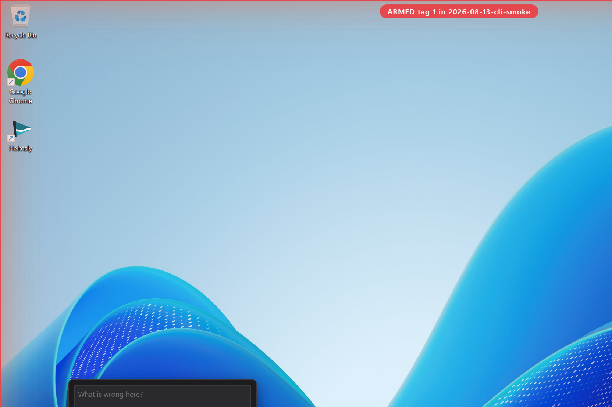

# TagFix

Tag what is wrong on screen, get a fix list out.

TagFix is a Windows 11 desktop overlay for visual QA sweeps. Arm it, drag a
box around anything that looks wrong, type a note, keep going. When the sweep
is done, export a fix list as markdown, a single-file HTML evidence ledger,
and an agent brief with one task and one acceptance criterion per tag. No
cloud, no accounts, no telemetry: everything lives in JSON files and PNGs on
your disk.

TagFix is not an audio metadata repair tool. Different itch entirely.



## Vocabulary

- **tag**: one captured item (a region plus a note plus metadata)
- **sweep**: one testing session containing many tags
- **fix list**: the exported document

## Install

1. Grab `tagfix.exe` (portable, unsigned, x64). No installer, no admin
   rights.
2. Put it in any folder you can write to. Sweeps land in a `sweeps` folder
   next to the exe unless you point the output directory elsewhere in
   Settings.
3. Run it. A TagFix icon appears in the system tray. On first run Windows
   may keep new tray icons hidden: drag the icon from the tray overflow onto
   the visible tray, or enable it under Settings, Personalization, Taskbar,
   Other system tray icons.

Requires the WebView2 runtime, which ships with Windows 11.

## Usage

1. Press `Ctrl+Shift+T` (or tray menu, Arm). A red frame and ARMED badge
   appear and the cursor becomes a crosshair.
2. Drag a box around the thing that is wrong. On release, a popover opens.
3. Type what is wrong. Pick severity (high, medium, low) and area (layout,
   copy, a11y, behaviour, other) or keep the defaults.
4. `Enter` saves the tag and you are immediately ready for the next one.
   `Shift+Enter` inserts a newline. `Esc` cancels the tag without saving.
5. `Esc` (outside tag entry) disarms. The overlay never intercepts clicks
   while disarmed.
6. `Ctrl+Shift+R` (or tray menu, Review and export): reorder tags by drag,
   edit text, change severity, drop tags (dropped tags stay in the sweep
   file and can be picked back up).
7. Press Export. Three files land in the sweep folder:
   - `fixlist.md`: the full evidence ledger, images by relative path
   - `fixlist.html`: single file, images inlined, opens anywhere offline
   - `brief.md`: agent brief, one task with an acceptance criterion per tag
   A one line pointer to `brief.md` is copied to the clipboard.

## CLI

```
tagfix sweep new <slug>    create a sweep folder for today
tagfix sweep list          list sweeps with tag counts
```

## Data layout

```
sweeps/
  2026-08-13-login-page/
    sweep.json      sweep metadata plus ordered tag array (schemaVersion 1)
    tag-01.png      captured region pixels
    fixlist.md      appears on export
    fixlist.html
    brief.md
```

## Building from source

Requires Rust (MSVC toolchain), the Windows 11 SDK, and Node only if you
want to regenerate icons. No bundler, no web framework, no CDN.

```
cd src-tauri
cargo build --release
```

The exe lands at `src-tauri/target/release/tagfix.exe`.

## Constraints honoured in v1

- Windows 11 x64 only
- No telemetry, no network calls, no auto-update
- No tracker features: no statuses, no assignees, no boards, no sync
